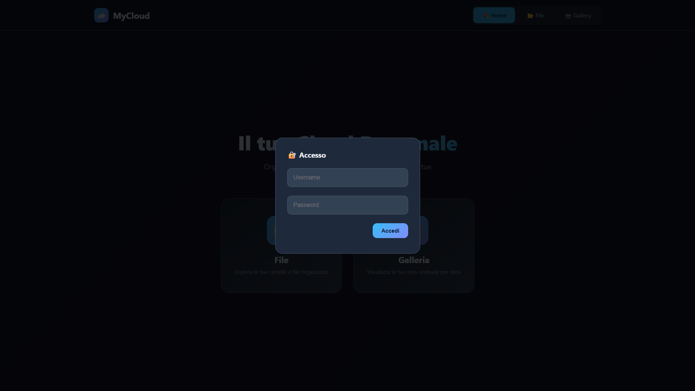
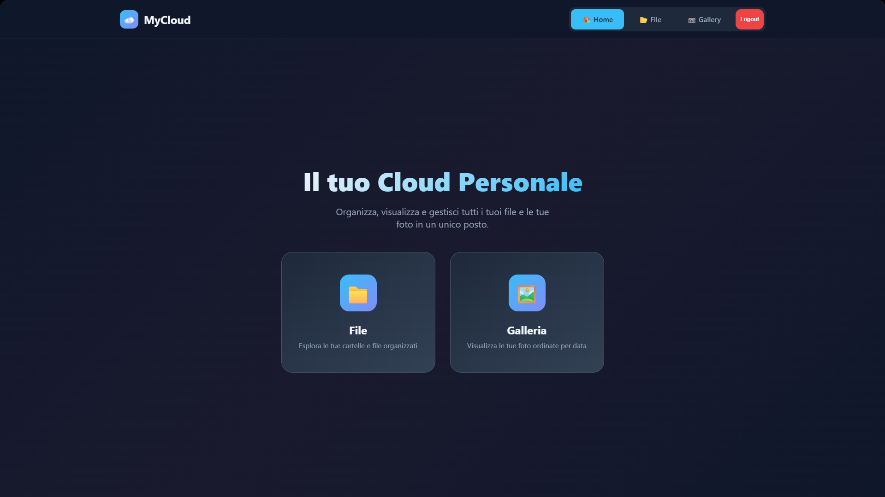
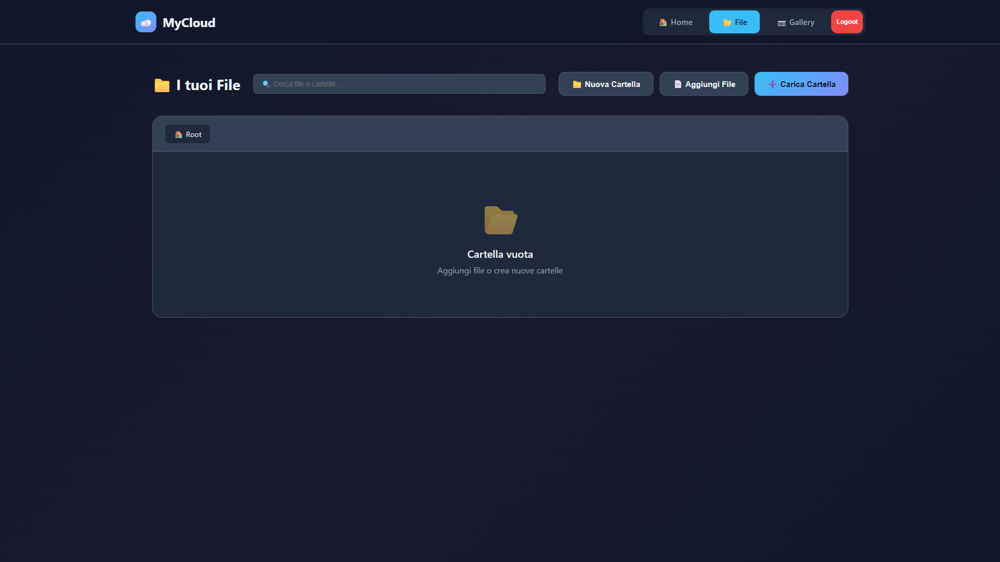
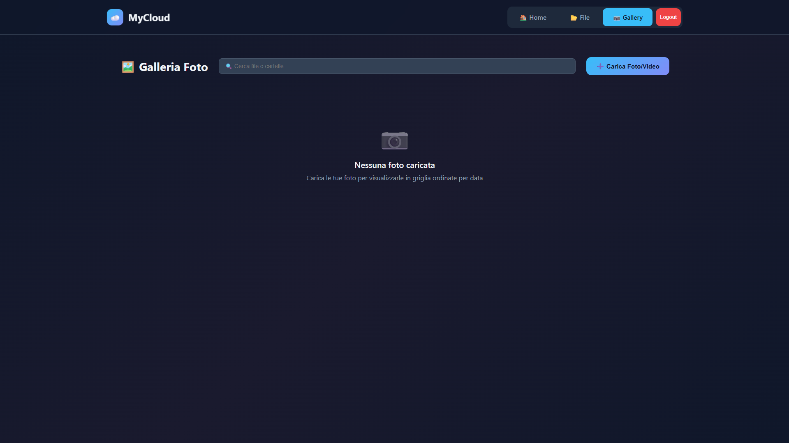

**MyCloud — README**

Questo repository contiene il front-end statico dell'app MyCloud e riferimenti al back-end e al file utenti. Per motivi di sicurezza il file del back-end (`app.py`) e il database degli utenti (`users.json`) NON devono essere pubblicati nella repository pubblica; nel repository locale sono presenti a scopo di sviluppo.

**Project Overview**
- **Front-end:** interfaccia single-file in [cloud_backup.html](cloud_backup.html) (HTML + CSS + JS).
- **Back-end (local/dev only):** server Flask implementato in app.py.
- **User DB (local/dev only):** users.json — contiene password hash.

**Front-End (cloud_backup.html):**
- **Struttura:** pagina monolitica che include layout, stili e script.
- **Sezioni principali:** `Home`, `Files`, `Gallery` (visibili tramite tab). Ci sono componenti UI come lightbox, modali (new folder, move, rename, confirm delete), toast di notifica e barre di progresso upload.
- **Funzionalità:** upload file e cartelle, navigazione gerarchica delle cartelle, operazioni su file (download, delete, move, rename), selezione multi-file, drag & drop, ricerca, anteprime immagini/video, selezione foto in gallery e cancellazione in batch.
- **Autenticazione UI:** schermata di login/registrazione gestita via chiamate a `/api/login` e `/api/logout`.
- **Interazione con il back-end:** il front-end si aspetta gli endpoint REST sotto il prefisso `/api/*` (vedi sezione Back-end). Gli URL statici di preview sono serviti da `/static/files/<user>/...` e `/static/gallery/<user>/...`.

**Back-End (sintesi, NON caricare su GitHub)**
- File: app.py — server Flask che espone gli endpoint usati dal front-end.
- Endpoint principali (riassunto):
  - `GET /api/files` — restituisce l'albero delle cartelle dell'utente.
  - `POST /api/files/upload` — upload di file
  - `POST /api/files/upload_folder` — upload di cartelle (multipart)
  - `POST /api/files/new_folder` — crea nuova cartella
  - `POST /api/files/delete` — elimina file o cartella
  - `POST /api/files/move` — sposta elementi
  - `POST /api/files/rename` — rinomina
  - `GET /api/files/download` — scarica singolo file
  - `GET /api/files/download_zip` — scarica una cartella come ZIP
  - `GET /api/gallery` — restituisce media raggruppati per giorno
  - `POST /api/gallery/upload` — upload per la gallery
  - `GET /api/gallery/thumbnail` — thumbnail on-demand (usato per NEF/raw)
  - `POST /api/gallery/delete` — elimina media
  - `POST /api/login` / `POST /api/logout` — autenticazione session-based
  - `GET /api/quota` — info quota usata / massima
- Note tecniche importanti:
  - L'app usa sessione server-side Flask (`session['user']`) per determinare l'utente.
  - Lo storage è locale sotto `static/files/<username>/...` e `static/gallery/<username>/...`.
  - Il back-end applica controllo quota (`MAX_USER_SPACE`) e tratta gli utenti con `role: "admin"` in modo differenziato (privilegi/nessun limite).
  - Per alcuni RAW (es. `.nef`) vengono chiamati strumenti esterni (`exiftool`, `dcraw`, `magick`) via `subprocess` per estrarre thumbnail; questi strumenti devono essere installati sul server per supportare i RAW.
  - Generazione on-demand delle thumbnail: `GET /api/gallery/thumbnail?file=<prefix/path>`.

**Database utenti users.json**
- Posizione di sviluppo: users.json.
- Formato:
  - Ogni chiave è il nome utente.
  - Ogni valore è un oggetto con almeno `password` (sha256 hex digest) e `role` (`user` o `admin`).
  - Esempio:
    {
      "alice": { "password": "<sha256>", "role": "user" }
    }

**Gerarchia cartelle letta dal back-end**
- Root del progetto (dev): contiene `app.py`, `cloud_backup.html`, `users.json` e la cartella `static/`.
- Percorsi creati/attesi dal back-end:
  - `static/files/` — spazio per i file degli utenti
    - `static/files/<username>/...` — file e sottocartelle dell'utente
  - `static/gallery/` — storage della gallery
    - `static/gallery/<username>/...` — media dedicati alla gallery
- Comportamento runtime:
  - Il back-end scansiona ricorsivamente `static/files/<user>` e `static/gallery/<user>` con funzioni come `build_file_tree()` e `scan_media()`.
  - I file con suffisso `_thumb.jpg` sono considerati thumbnails e sono ignorati come media reali.
  - Per download/preview il front-end richiede risorse sotto `/static/files/<user>/...` e `/static/gallery/<user>/...` (servite direttamente da Flask/static in sviluppo).

**Eseguire il server in locale (sviluppo)**
- Prerequisiti: `python >= 3.8`, `pip`, strumenti opzionali per RAW: `exiftool`, `dcraw`, `imagemagick`/`magick`.
- Esempio di setup rapido:

```bash
python -m venv venv
venv\Scripts\activate    # Windows
pip install -r requirements.txt  # se fornito, altrimenti almeno: flask pillow
python app.py
```

- Il server per sviluppo ascolta tipicamente su `http://0.0.0.0:9000` come indicato in `app.py`.

## Screenshot Dashboard

Ecco come appare la dashboard su Desktop Display:




